# Openwebui User Manual

### 📦 Part 1: Installation

Before starting Open-WebUI, make sure you have already started the LLM model and embedding model through middleware.

1. Please download [Open-webui_installation.zip](https://phison-software-bucket.s3.ap-northeast-1.amazonaws.com/aiDAPTIV_Application/open-webui/Open-webui_installation.zip)
2. Unzip `Open-webui_installation.zip`, you will get `open-webui.zip` and `setup_and_run.bat` in the same directory.
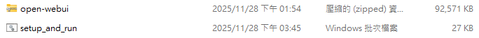
3. Double-click `setup_and_run.bat` to launch Open-WebUI.
4. The first time you launch Open-WebUI, it will unzip `open-webui.zip`, install Python, and set up the environment. Then you can use Open-WebUI in your browser.

### ⚙️ Part 2: Setting Parameters for LLM, Embedding Model, Knowledge Management, and Open-WebUI
1. If you have already set it up, the settings will be stored in config.txt. You can directly use it. The batch file will verify that the settings still work.
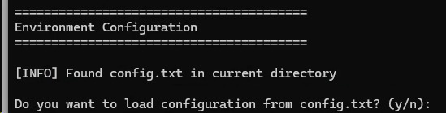
1. Setting the LLM model endpoint:
   You can see the model information in the "models" endpoint, and provide the endpoint with version as the LLM URL.
   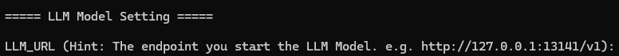
   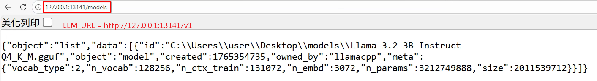
2. Setting the Embedding model endpoint for Knowledge Management:
   You can see the model information in the "models" endpoint, and provide the endpoint with version as the Embedding URL.
   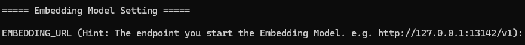
   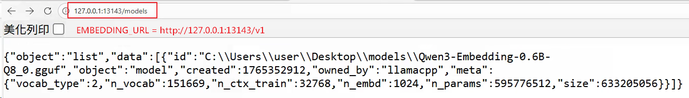
3. Setting tokenizer model for Knowledge Management:
   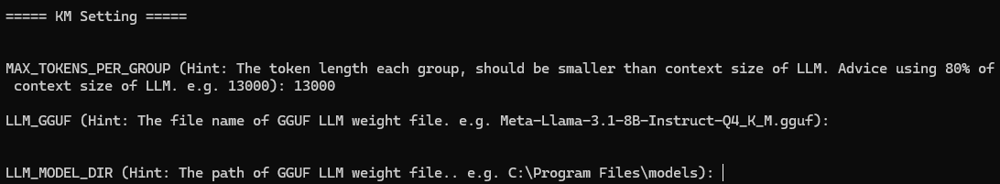
   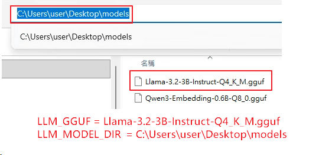

### 🎯 Part 3: Getting Started
1. When Open-WebUI is ready, you will see the log like the following image.
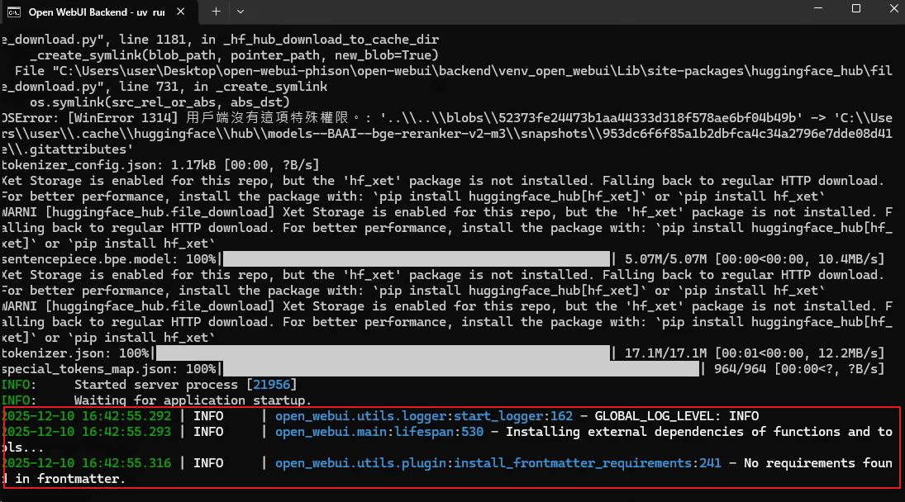
2. You can get started by opening it in your browser.
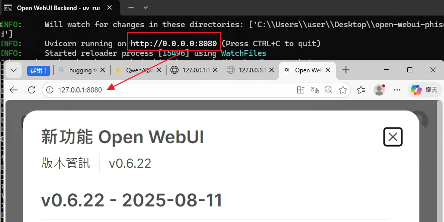
3. Upload files to Knowledge. We have prepared some sample questions in the open-webui folder. Please wait until the LLM finishes processing.

---

### 🤖 Part 4: Running Inference + RAG

#### Query Methods

1. **Normal Chat:** Directly enter your question in the chat box (will not perform collection retrieval)
2. **Agent Chat:**
   (1) Type <# hashtag symbol> in the chat box and click the collection you create.
   (2) Enter your question after the hashtag

   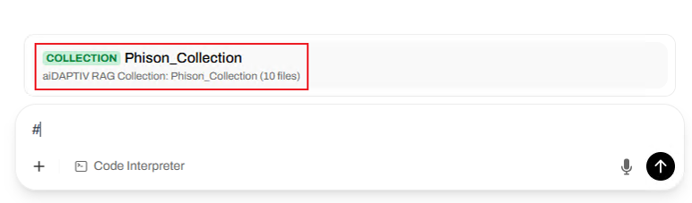

#### Verifying Execution Flow

Please confirm the following indicators:

1. **Time To First Token (TTFT) is between 2 ~ 8 seconds**
2. **RAG reference documents are displayed below the response**

   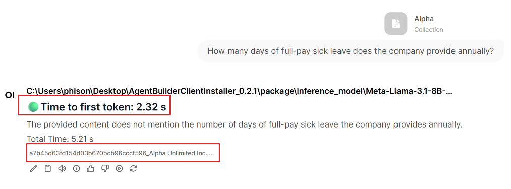

---
