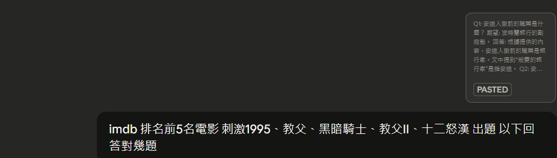

把.txt測試結果丟給 ChatGPT 5.2

imdb 排名前5名電影 刺激1995、教父、黑暗騎士、教父II、十二怒漢 出題 以下回答對幾題

* 第一份:專案RAG.txt
* 第二份:一般RAG.txt

很好，這題可以直接看出兩份回答的「理解落點」差在哪。我用同一評分標準，把 **每題的判定、兩份的差異、錯在哪裡** 整理成一張對照表。

---

# 🎬 兩份答案比較總表

| 題號  | 第一份判定  | 第二份判定  | 哪裡錯 / 差異說明                                 |
| --- | ------ | ------ | ------------------------------------------ |
| Q1  | ✔ 正確   | △ 部分正確 | 第一份精準說出「銀行副總裁」。第二份只說「銀行家」，方向對但不夠精確。        |
| Q2  | ✘ 錯誤   | ✘ 錯誤   | 兩份都答錯核心物品。正解是**鶴嘴槌**。第一份說照片；第二份說鞋擦，且用途完全錯。 |
| Q3  | ✔ 正確   | ✔ 正確   | 兩份都抓到「兩週禁閉＋值得」。                            |
| Q4  | ✘ 錯誤   | ✘ 錯誤   | 題目問的是**婚禮當天不能拒絕請求的文化規則**。兩份都只講女兒被害背景，答非所問。 |
| Q5  | △ 部分正確 | △ 部分正確 | 都說對軍師身份，但漏掉「被收養」這個關鍵背景。                    |
| Q6  | ✔ 正確   | ✔ 正確   | 槍藏在馬桶水箱 → 兩份都命中核心。                         |
| Q7  | △ 部分正確 | △ 部分正確 | 都提到父兄被殺，但缺少「黑手黨追殺＋母親犧牲」這條完整動機鏈。            |
| Q8  | ✔ 正確   | ✔ 正確   | 黑手黨勒索鄰里 → 兩份都抓到核心。                         |
| Q9  | ✘ 錯誤   | ✔ 正確   | 第一份完全沒提金額與比例。第二份命中「25萬＋5%」，核心正確。           |
| Q10 | ✘ 錯誤   | ✘ 錯誤   | 小丑計畫的核心是「互殺同夥」。兩份都編出不存在劇情。                 |
| Q11 | ✘ 錯誤   | ✔ 正確   | 第一份說錯硬幣來歷。第二份命中父親幸運幣＋約會背景。                 |
| Q12 | ✔ 正確   | ✘ 錯誤   | 第一份說對「裝甲太重需要更快」。第二份等於沒回答。                  |
| Q13 | ✘ 錯誤   | ✔ 正確   | 第一份票數錯。第二份正確。                              |
| Q14 | ✔ 正確   | ✔ 正確   | 八號陪審員買同款刀 → 兩份都抓到核心證據。                     |
| Q15 | △ 部分正確 | ✔ 正確   | 第一份時間細節偏差。第二份完整命中質疑點。                      |

---

# 📊 整體比較

| 類型     | 第一份 | 第二份 |
| ------ | --- | --- |
| ✔ 正確   | 6   | 8   |
| △ 部分正確 | 3   | 3   |
| ✘ 錯誤   | 6   | 4   |

換算分數（部分算半分）：

👉 第一份：約 **7.5 / 15**
👉 第二份：約 **9.5 / 15**

---

# ⭐ 關鍵差異觀察

### 第一份的典型問題

* 容易**偏題**（Q4）
* 有幾題屬於**錯誤劇情重構**（Q2、Q10、Q11）
* 細節不穩（Q13、Q15）

### 第二份的典型問題

* 偶爾**泛化答案**（Q1）
* 有明顯「資料缺失式回答」（Q12）
* 但劇情理解整體更穩

---

如果你願意，我可以下一步幫你做：

✅ 錯題重寫成標準答案版
✅ 劇情理解陷阱題版
✅ IMDb 電影進階知識測驗
✅ AI 評分模板

你想往哪個方向繼續？🎥🧠
